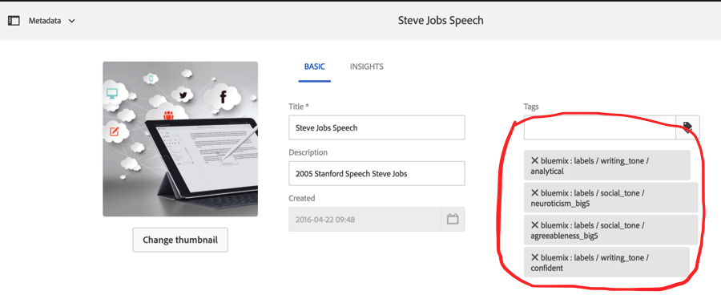

Adobe AEM content intelligence with IBM Watson API
========

Sample project using IBM Watson to analyze content fragments within Adobe AEM.

It contains a workflow process steps that calls the Watson API, and assigns the results as metadata to the content fragment. To use, incorporate the workflow process step in a workflow.

The tags are created with namespace bluemix.

An example result using Steve Jobs’ 2005 Stanford commencement speech can be seen in this screenshot:



Running
--------
First setup access to the [IBM Watson Tone Analyzer](http://www.ibm.com/smarterplanet/us/en/ibmwatson/developercloud/tone-analyzer.html)

Once you retrieve your credentials, set the following environment variables.
```bash
    export IBM_API_USER_NAME=<api_user_name>
    export IBM_API_PASSWORD=<api_password>
```
* Start your AEM instance in this environment.
* Create a workflow to use the tone analyzer process steps and select an asset.


## Project Structure

This is created based on the standard project template for AEM-based applications. 

## How to build

To build all the modules run in the project root directory the following command with Maven 3:

    mvn clean install

If you have a running AEM instance you can build and package the whole project and deploy into AEM with  

    mvn clean install -PautoInstallPackage
    
Or to deploy it to a publish instance, run

    mvn clean install -PautoInstallPackagePublish
    
Or to deploy only the bundle to the author, run

    mvn clean install -PautoInstallBundle

## Testing

There are three levels of testing contained in the project:

* unit test in core: this show-cases classic unit testing of the code contained in the bundle. To test, execute:

    mvn clean test

* server-side integration tests: this allows to run unit-like tests in the AEM-environment, ie on the AEM server. To test, execute:

    mvn clean integration-test -PintegrationTests

* client-side Hobbes.js tests: JavaScript-based browser-side tests that verify browser-side behavior. To test:

    in the browser, open the page in 'Developer mode', open the left panel and switch to the 'Tests' tab and find the generated 'MyName Tests' and run them.


## Maven settings

The project comes with the auto-public repository configured. To setup the repository in your Maven settings, refer to:

    http://helpx.adobe.com/experience-manager/kb/SetUpTheAdobeMavenRepository.html
